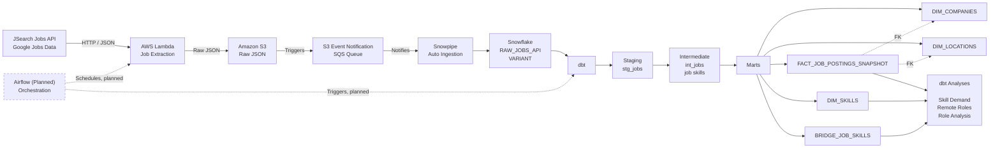
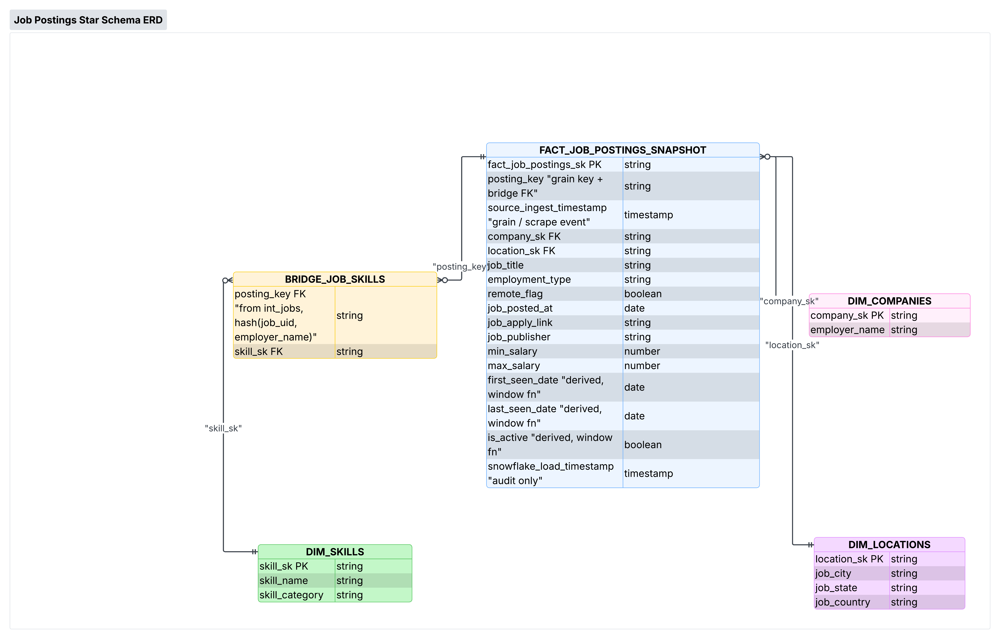

# Job Tracker Data Pipeline

An end-to-end cloud data engineering pipeline that extracts live job postings from the JSearch Jobs API, lands raw data in Amazon S3, auto-ingests it into Snowflake via Snowpipe, and transforms it with dbt into analytics-ready models for tracking data engineering / analytics engineering job-market trends.

**Stack:** AWS Lambda · Amazon S3 · Snowflake · Snowpipe · dbt · Python · Airflow (planned)

## Overview

This project simulates a production-style ELT pipeline for job-market analytics. Job postings are pulled on a recurring basis from the JSearch API (Google Jobs data), stored as raw JSON in S3, and automatically ingested into Snowflake using Snowpipe. dbt then transforms the raw VARIANT data through staging, intermediate, and mart layers into a star schema that supports analysis of in-demand skills, remote work trends, and role-level patterns.

The pipeline is designed to accumulate history across ingestion runs (not a one-time load), which surfaces real-world data engineering challenges around identifier stability, deduplication, and slowly changing data — see [Data Quality Notes](#data-quality-notes) below.

## Architecture



## Data Source

Job postings are pulled from the [JSearch API](https://rapidapi.com/letscrape-6bRBa3QguO5/api/jsearch) (aggregated Google Jobs data), filtered to data engineering and analytics engineering roles. Each API response is written to S3 as raw JSON, preserving the full payload for reprocessing if the transformation logic changes.

## Data Model / Star Schema

A job posting can require multiple skills, and a skill can appear across many job postings — a classic many-to-many relationship. This is modeled with a bridge table pattern:

- **`FACT_JOB_POSTINGS_SNAPSHOT`** — one row per job posting snapshot
- **`DIM_COMPANIES`**, **`DIM_LOCATIONS`**, **`DIM_SKILLS`** — conformed dimensions
- **`BRIDGE_JOB_SKILLS`** — resolves the many-to-many relationship between jobs and skills



Skill matching is driven by a seed file (`skill_category`, `skill_name`, `match_text`) that maps raw text in job descriptions to a normalized skill taxonomy, keyed off a surrogate key generated from `skill_name`.

## dbt Project Structure

```
models/
├── staging/
│   └── stg_jobs.sql          # 1:1 cleanup of raw VARIANT payload
├── intermediate/
│   └── int_jobs.sql          # skill extraction / parsing logic
└── marts/
    ├── fact_job_postings_snapshot.sql
    ├── dim_companies.sql
    ├── dim_locations.sql
    ├── dim_skills.sql
    └── bridge_job_skills.sql
seeds/
└── skills_seed.csv           # skill_category, skill_name, match_text
analyses/
├── skill_demand.sql
├── remote_roles.sql
└── role_analysis.sql
```

## Key Engineering Decision: the business key

`job_uid` (JSearch's short ID) turned out to be **unstable** — the same value showed up attached to different employers across ingestion runs. Rather than assume this was rare or work around it blindly, the collision rate was measured:

```sql
SELECT COUNT_IF(employer_count > 1) / NULLIF(COUNT(*), 0)::FLOAT AS multiple_employer_rate
FROM (
    SELECT job_uid, COUNT(DISTINCT employer_name) AS employer_count
    FROM {{ ref('int_jobs') }}
    WHERE job_uid IS NOT NULL AND employer_name IS NOT NULL
    GROUP BY job_uid
)
```

**Result: 2 of 145 `job_uid`s (~1.4%)** mapped to more than one employer — small, but frequent enough (~1 in 70) to silently misattribute postings if trusted alone. That justified using **`job_uid` + `employer_name`** as the composite business key.

A dbt test now tracks this rate on every run and fails if it exceeds 2% (set above the measured baseline to catch drift, not flag normal noise), so if JSearch's ID behavior degrades further, it's caught rather than silently tolerated.

## Analyses

- **Skill Demand** — most-requested skills across postings *(caveat: `BRIDGE_JOB_SKILLS` is regex-matched, so this measures "% of postings where the taxonomy detected the skill," not "% that truly require it" — descriptions phrased outside the match patterns are undercounted)*
- **Remote Roles** — remote vs. on-site share/trend
- **Role Analysis** — includes **Total Observed Postings**: distinct postings captured across all snapshot runs, including inactive ones

> Company- and location-level cuts (`DIM_COMPANIES`, `DIM_LOCATIONS`) are modeled but not yet wired into an analysis — flagged under Future Enhancements.

## dbt Structure

```
models/staging/stg_jobs.sql
models/intermediate/int_jobs.sql
models/marts/{fact_job_postings_snapshot, dim_companies, dim_locations, dim_skills, bridge_job_skills}.sql
seeds/skills_seed.csv
analyses/{skill_demand, remote_roles, role_analysis}.sql
```
## Setup

> Fill in with your actual commands/env vars before publishing.

1. Clone the repo and configure AWS credentials for the Lambda + S3 resources.
2. Set up a Snowflake account with a Snowpipe object pointed at the S3 bucket (via SQS event notification).
3. Configure `profiles.yml` with your Snowflake connection details.
4. Install dependencies and run dbt:
   ```bash
   dbt deps
   dbt seed
   dbt run
   dbt test
   ```

## Future Enhancements

- Add dbt incremental models
- Add Airflow scheduler for recurring extraction + dbt runs
- Extend analyses to use `DIM_COMPANIES` and `DIM_LOCATIONS`

---

Built as a portfolio project to demonstrate modern cloud data engineering practices using AWS, Snowflake, dbt, Python, and Git.
